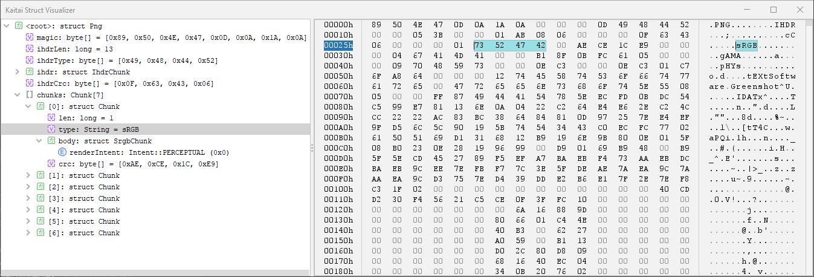

# Kaitai Struct: visualization GUI tool in Java

This is a Java-based GUI for data structure visualizations in binary
formats, based on [Kaitai Struct](http://kaitai.io) project. This vis
tool uses [Java's Swing](https://en.wikipedia.org/wiki/Swing_%28Java%29)
for its GUI elements.

Its functionality is akin to similar projects:

* [kaitai_struct_visualizer](https://github.com/kaitai-io/kaitai_struct_visualizer) in Ruby
* [WebIDE](https://ide.kaitai.io/) in TypeScript for web brosers
* [kaitai-struct-vscode](https://marketplace.visualstudio.com/items?itemName=fudgepops.kaitai-struct-vscode) in TypeScript for [VS Code](https://code.visualstudio.com/)

... but this Java version is significantly simpler and is no longer under
active development.

> Note: This tool is a CLI tool that provides a GUI interface.

## Overview



Kaitai Struct is a declarative language used to describe various
binary data structures, laid out in files or in memory: i.e. binary
file formats, network stream packet formats, etc.

The main idea is that a particular format is described in Kaitai
Struct language (`.ksy` files) only once and then can be compiled with
this compiler into source files in one of the supported programming
languages. These modules will include the generated code for a parser
that can read described data structure from a file / stream and give
access to it in a nice, easy-to-comprehend API.

## Build
Install java, gradle and, if on windows, git-bash

Run in console:

```bash
gradlew build KaitaiStructGUI
```

## How to use

Since this tool is accessed via the command line, here is a quick introduction on how to use it.

```bash
java -jar ./build/libs/proto4j-kaitai_struct_gui-0.11.jar -ksy ./docs/png.ksy ./docs/Example.png
```

> Note: To apply dark-mode, just use `-dark` as an extra argument.

### Parameter overview

```text
Usage: <path/to/jar> [options] Path to the binary
  Options:
    -h, --help
      Show this help message.
      Default: false
    -dark
      Enables dark layout.
      Default: false
    -java
      Path to generated Java file
    -ksy
      Path to the .ksy file
```

## Licensing

This GUI vis tool project itself is copyright (C) 2016-2019 Kaitai
Project.

This program is free software: you can redistribute it and/or modify
it under the terms of the GNU General Public License as published by
the Free Software Foundation, either version 3 of the License, or (at
your option) any later version.

This program is distributed in the hope that it will be useful, but
WITHOUT ANY WARRANTY; without even the implied warranty of
MERCHANTABILITY or FITNESS FOR A PARTICULAR PURPOSE.  See the GNU
General Public License for more details.

You should have received a copy of the GNU General Public License
along with this program.  If not, see <http://www.gnu.org/licenses/>.

### Libraries used

Vis tool depends on the following libraries:

* [kaitai_struct_compiler](https://github.com/kaitai_struct_compiler) — GPLv3+ license
  * [fastparse](http://www.lihaoyi.com/fastparse/) — MIT license
  * [snakeyaml](https://bitbucket.org/asomov/snakeyaml) — Apache 2.0 license
* [JHexViewer](https://github.com/rendner/jhexviewer) — MIT license
* [Proto4j-IconManager](https://github.com/Proto4j/proto4j-iconmgr) — MIT License
* [Apache-Batik](https://xmlgraphics.apache.org/batik) — Apache 2.0 license
* [JetBrains-Icons](https://jetbrains.design/intellij/resources/icons_list/) — Apache 2.0 license
* [JCommander](https://jcommander.org) — Apache 2.0 license